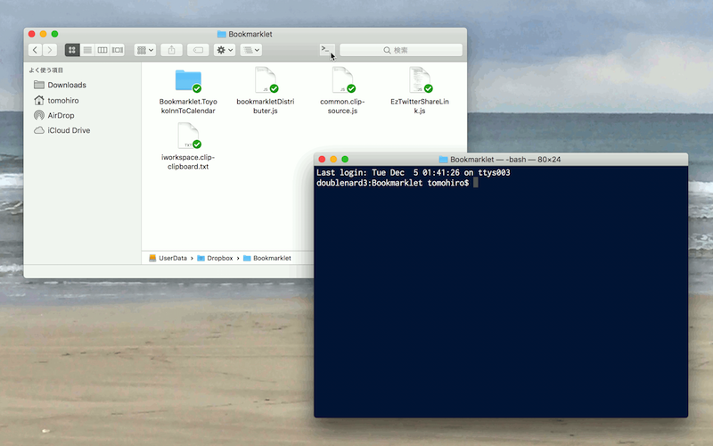

# OpenTerminal for macOS

This is a app to open a `Terminal` window from `Finder` window. To launch this app, a new `Terminal` window will be opened and move the current directory to the folder's path.

## How to use

Just launch `OpenTerminal.app`.

We can also register this apps to `Finder`'s toolbar, then launch it from there. In this way, we can open a new `Terminal` window with the finder's path as current directory immediately.

## How to register to toolbar

First, `OpenTerminal` app move to any folder (e.g. `/Application` or `~/Application`) then the app drag with `⌘`+`⌥` keys, and drop it to toolbar in any `Finder`.